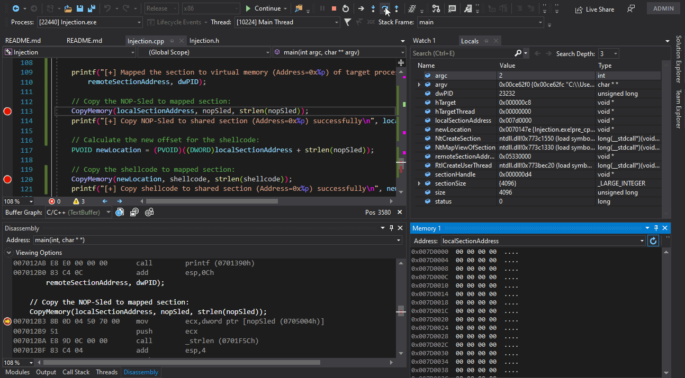
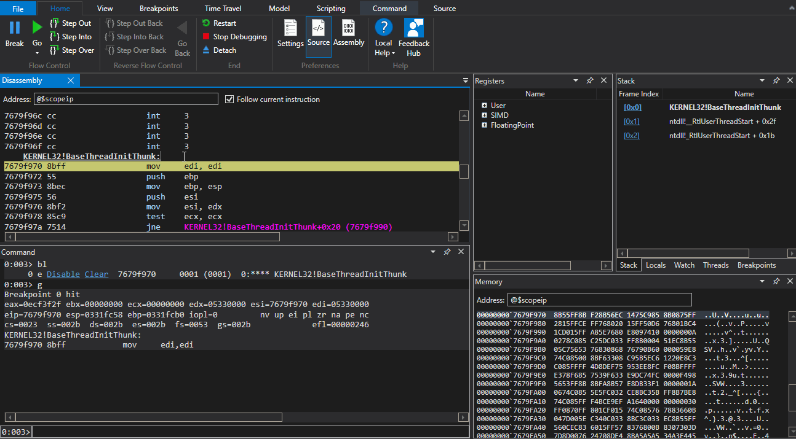

# Injection using NtMapViewOfSection

Background
-
This method exploiting Windows ability of create shared section between processes. 
By creating Section that shared between processes, 
malicious process can write anything to the shared section and 
latter trigger the execution of the malicious code in the target process.

---

Steps
-
1. Create new section with RWX permission in the malicious process.
2. Map the new section to virtual memory.
3. Open handle to target process.
4. Map the section to the target process (share memory).
5. Write shellcode into the mapped section.
6. start thread for executing the shellcode in the target process.
---

Pros & Cons
-
* Creating remote thread for executing the shellcode could trigger EDRs.
* Depend on shellcode for injection \ Reflective code.

--- 

Example
-
Copying the shellcode to the shared section:
 

Execution of the shellcode in the target process:
 

---

Useful links
-
1. NtMapViewOfSection from "NTAPI Undocumented Functions" - http://undocumented.ntinternals.net/index.html?page=UserMode%2FUndocumented%20Functions%2FNT%20Objects%2FSection%2FNtMapViewOfSection.html
2. Windows Process Injection in 2019, Safebreach Labs - https://i.blackhat.com/USA-19/Thursday/us-19-Kotler-Process-Injection-Techniques-Gotta-Catch-Them-All-wp.pdf
3. Ten process injection techniques, Elastic - https://www.elastic.co/blog/ten-process-injection-techniques-technical-survey-common-and-trending-process
4. NtCreateSection + NtMapViewOfSection Code Injection - https://www.ired.team/offensive-security/code-injection-process-injection/ntcreatesection-+-ntmapviewofsection-code-injection

Disclaimer
-
This repository is for research purposes only, the use of this code is your responsibility.

I take NO responsibility and/or liability for how you choose to use any of the source code available here. By using any of the files available in this repository, you understand that you are AGREEING TO USE AT YOUR OWN RISK. Once again, ALL files available here are for EDUCATION and/or RESEARCH purposes ONLY.

Any actions and/or activities related to the material contained within this repository is solely your responsibility.

This repository does not promote any hacking related activity. All the information in this repository is for educational purposes only.